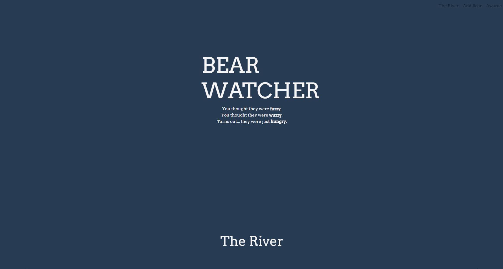
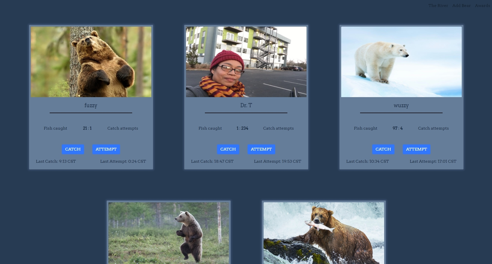
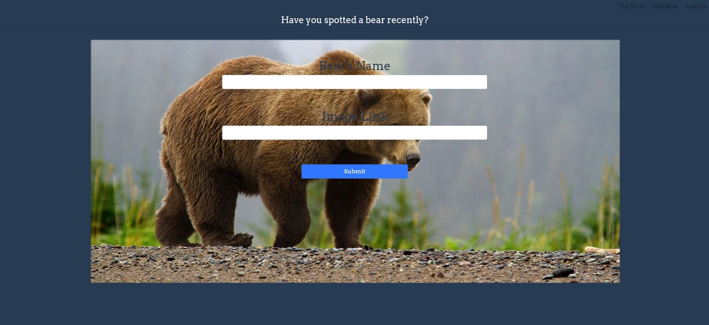
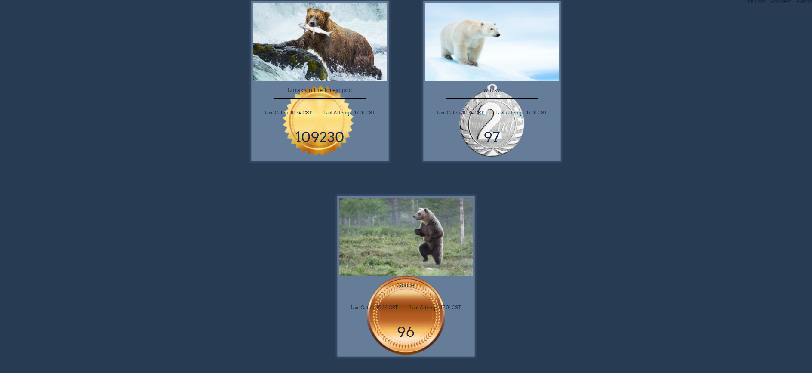

# BEARWATCHER

### Overview 
In BEARWATCHER the user will be able to see a list of spotted bears and keep track of amount of fish they each have caught, as well as failed attempts. They will also see times that the bear has last caught or attempted to catch a fish. At the end of the page the user can see which bears have eaten the most fish.

### Wireframes

https://www.figma.com/file/EQknPwtAK0SaQk0ZlbNEf1/Landing-Page?node-id=0%3A1

### Deployed Site

https://jr-bearwatcher.netlify.app/
### Project board

https://github.com/jrobinson0529/ASSIGNMENT-Bear-Watcher/projects/1

### User Story

1. As a user I will land on the page seeing the title of the page as well as a navbar with three links in the top right. I can use the navbar to scroll to each part of the page or scroll manually.
2. As a user when I scroll down to the "River" section of the page I will see all the bears currently being tracked. I can see: A picture of the bear, their name, how many fish they have caught, how many failed attempts to catch a fish, what time they last caught or attempted to catch a fish, and finally I can see two buttosn that allows the me to add a caught fish or an attempt and update the timestamps accordingly.
3. As a user when I scroll down I can enter my own bear to the River through the form. On the form it is required that I enter both a valid URL and the name of the bear. When the bear is added he will have all the other relevant information input for him.
4. As a user when I scroll down past the form I will see the "Awards" section of the page. In here I can see which bears have eaten the most fish. If there is a tie in any of the places it will display two winners for that place. The bears here look similar to the ones above but they have a gold, silver, or bronze medal.

### Features

- Dynamically added components across the whole page
- Navbar for quickly navigating page
- Ability to create new bears
- Dynamically updated awards section
- Ability to update the bears information with simple button presses

### Screenshots

##### Landing section

##### The River

##### The Form

##### The Awards

### Loom Video

https://www.loom.com/share/fbdd6538cc744e28a277fd38a7254ae5

### Contributors

[Jesse Robinson](https://github.com/jrobinson0529)

Thanks for Reading!
